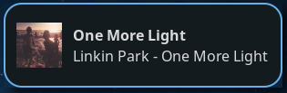

<h2 align="center">Everblush Dunst Theme</h2>

 

## Preview

## Usage

1. Copy the content of `src/everblush.conf` into `~/.config/dunst/dunstrc`

## Credits 💝

- [bryant-the-coder](https://github.com/bryant-the-coder).
